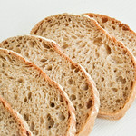
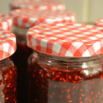

<!--

author:   Elizabeth Drellich and Joy Payton
email:    dlarcuseducation@email.chop.edu
version:  0.1.0
language: en
narrator: US English Female

-->

# Peanut Butter and Jelly, an Overview

A peanut butter and jelly sandwich is the quintessential, love it or hate it staple of American childhood lunches. It is a culture icon. But where did it come from, and what is it really?

In 1901, Julia Davis Chandler wrote in [The Boston Cooking School Magazine of Culinary Science and Domestic Economics](https://babel.hathitrust.org/cgi/pt?id=mdp.39015036669904&view=1up&seq=200&q1=peanut):

> For variety, some day try making little sandwiches, or bread fingers, of three very thin layers of bread and two of fill- ing, one of peanut; paste, whatever brand you prefer, and currant or crab-apple jelly for the other. _**The combination is delicious, and, so far as I know, original.**_  


## Ingredients

 
gallery of images, with alt text

### Breads

My favorite types of bread are itemized this un-ordered list:

- whole wheat bread
- rye bread
- sourdough bread
- bagels, particularly

  - everything bagels
  - sesame seed bagels
  - blueberry bagels

---

Less fluffy breads that can still be used for sandwiches, enumerated from my most to least favorite:

1. rice cakes
2. tortillas
3. matzah

### Peanut and Other Butters
Peanut butter is not the only type of "butter" you can use:

| Type of Butter | Yumminess Ranking | Comments |
|:-|:-:|-|
| Peanut Butter  | 8 | Traditional, but peanuts are a common allergy. |
| Sunflower Seed Butter  | 7.5 | Nut-free butter avoids most allergies. |
| Cashew Butter  | 8.5 | Cashew butter is more expensive than peanut butter, but cashews can also be more delicious than peanuts. |
| Almond Butter  | 6 | Traditional, but peanuts are a common allergy. |
| Hazelnut and Chocolate Butter  | 10 | Nutella can be used instead of or in addition to the traditional peanut butter. |
| Butter  | 3 | Toast with butter and jam is a warm, deconstructed PBJ sandwich with dairy substituted for peanuts. |


### Jelly and Jelly Alternatives

video of jigggling jelly

ascii art


## Assembly


### Sandwich Quiz
What do you need to create traditional a peanut butter and jelly sandwich? Check all that apply.

[[X]] Bread
[[X]] Peanut Butter
[[ ]] Lettuce
[[X]] Jelly
[[?]] You can choose more than one correct answer!
***
<div class = "answer">

A traditional PB&J needs peanut butter, jelly, and bread! Lettuce isn't a traditional component.

</div>
***

Which of these is NOT an acceptable type of bread for a peanut butter and jelly sandwich?

[( )] Pita bread
[(X)] Sliced tomato
[( )] Crackers
[( )] Naan
***
<div class = "answer">

There is nothing wrong with combining peanut butter, jelly, and sliced tomatoes, they just won't stay together as a sandwich!

</div>
***

Describe how you feel about peanut butter and jelly sandwiches.

[[___ ___ ___ ]]

## Consumption
What are the instructions for eating a peanut butter and jelly sandwich?

```
while SANDWICH
  take a bite
  chew
  swallow
  if THIRSTY
    drink beverage
```

These pseudocode instructions could also be written in a particular language, like Python:

``` python Eating a Sandwich
while SANDWICH:
  my_bite = bite(SANDWICH)
  chew(my_bite)
  swallow(my_bite)
  if THIRSTY == TRUE:
    drink_beverage
```


## Discussion
links to learn more
