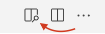

<!--
author: Elizabeth Drellich
email: drelliche@chop.edu
title: Workshop Agenda
version: 1.0
-->


# Agenda

As part of the LIEAF 2022 Workshop on [Creating Open Source Informatics Instructional Resources](https://github.com/arcus/LIEAF2022_workshop/tree/joy-github), we will transform a plain text file first into a markdown file.

After learning the basics of markdown, we will add more features using LiaScript.

## Text to Markdown
In your forked copy of the PBJ repository:

1. Make a copy of the `PBJ_text.txt` file.
2. Change file extension from `.txt` to `.md`.
3. Rename the file if you want.
4. Toggle the preview to the file you are editing using the "Open Preview" button in the upper right of the development screen. You can alternatively press `Command K` then `V` to open the side by side view.




### Text Formatting
- headings
- **bold**
- _italics_

> block quotes

- _**bold-italics**_
- linking to [websites](https://github.com)

### Images
Images are similar to linking to websites, but require a `!` in front of the square brackets.

- path to the image goes in the parentheses
- alt text for the image goes in the square brackets

```

```

The alt text describes the information and function of the image.
A screen reader will announce "IMAGE" followed by your alt text.
Learn more about about [alt text](https://www.w3.org/WAI/tutorials/images/) from the World Wide Web Consortium.

### Lists
- itemized lists
* can use `-` or `*` to denote items

  - indenting matters
  - extra line before indented section

1. enumerated lists
3. the number `3.` doesn't matter for markdown
4. but does for LiaScript

### Tables
- `|` notation
- alignment using `:-:` notation

This code

```
|Example | Table | Here |
|    -   |    -: |   :- |
|1       |  2    |    3 |
|a|b|c|
```

is rendered by markdown as this table:

|Example | Table | Here |
|    -   |    -: |   :- |
|1       |  2    |    3 |
|a|b|c|

### Code Blocks
- generic code block: put `\`\`\``  on its own line both before and after the code.
- specifying a language for code block highlighting: after the opening `\`\`\`` include the name of the language like `\`\`\`python` or `\`\`\`r`
- inline code `code here`

## Markdown to LiaScript

First you will need to install the LiaScript Previewer.

1. Open the Extensions menu on the left side of screen using `Shift` `Command` `X` or the menu button.
2. Enter "LiaScript" in the search bar.
3. Select the `Install` button under "LiaScript-Preview-Web"
4. Once the previewer is installed, the command `Alt` `L` will now open the LiaScript previewer.

Navigate back to your `.md` file and type `Alt` `L` to open the previewer. Now you can start see how your course looks in LiaScript.


### Including Media
* captions go in quotes: ``

  * Captions will be displayed
  * A caption tells information related to the image, supplemental to the image itself.

    * Attribution
    * Interpretation
    * Commentary


* images can be arrayed in a gallery
* Other types of media can also be included:

  - `!?[]()`  for video
  - `?[]()` for audio files
  - `??[]()` for multimedia files

### Displaying Data

Look at the buttons next to the two tables we already made:

* Bar charts/line graphs
* Pie chart

### Quizzes
* Multiple choice (one or multiple correct answers use `[(X)]` and `[[X]]` respectively)
* Hints `[?]`
* Answers are our first look at incorporating html to push capabilities farther

```
<div class = "answer">

Text will be displayed after question is completed.

Include line breaks between <div>s and text.

</div>

```


### Metadata and YAML
* Start document with a header: `<!--  metadata goes here   -->`

* Include metadata:
```
<!--
author: Elizabeth Drellich
email: drelliche@chop.edu
title: Workshop Agenda
version: 1.0
-->
```

* LiaScript specific tags:

  * `langague: en`
  * `narrator: UK English Female`

* Scripts and macros can also go in this header

## Publishing your course
Make sure you commit your work to GitHub!!!

Then...

* Markdown renders on GitHub directly https://github.com/arcus/PBJ/blob/main/PBJ_liascript.md


* Go to liascript.github.io
??[](https://liascript.github.io)

* Enter the url of your `.md` file. For this "Agenda" file, that url is https://github.com/arcus/PBJ/blob/main/agenda.md
* Obtain rendered course.

You can share this rendered course directly with learners.

For this "Agenda" course, the link is https://liascript.github.io/course/?https://raw.githubusercontent.com/arcus/PBJ/main/agenda.md#1

??[](https://liascript.github.io/course/?https://raw.githubusercontent.com/arcus/PBJ/main/agenda.md#1)
